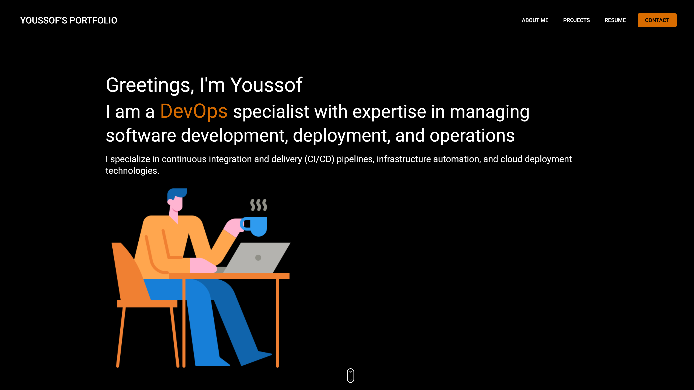

# Blazor Portfolio Project

This is an interactive Blazor application built with the MudBlazor framework. The application uses ASP.NET Web API to fetch project data and send contact emails. The project is structured into client and server folders, with separate web API endpoints for mail and project data. (Not going to update this portfolio anymore since i migrated to react as frontend)

# Preview


## Features

- Interactive Blazor client application
- Utilizes MudBlazor for UI components
- ASP.NET Web API for backend services
- PostgreSQL database integration
- Two web API endpoints:
  - `/api/Mail` for sending emails
  - `/api/Project` for fetching project data

## Project Structure

```plaintext
YoussofPortfolio/
├── Client/
│   └── [Blazor Client Project Files]
├── Server/
│   └── [Blazor Server Project Files]
YoussofPortfolio.API/
│   ├── Controllers/

```
## Prerequisites
- NET 8.0 SDK
- PostgreSQL database

## Getting Started

1. Clone the repository
```sh
git clone https://github.com/youssofkhawaja/MyPortfolio-Blazor.git
cd MyPortfolio-Blazor
```
2. Configure the database connection in `appsettings.json`
3. Build and run the project:
```sh
dotnet build
dotnet run
```

## Configuring appsettings.json
#### To connect to your PostgreSQL database, update the appsettings.json file in the Server project with your database connection string
```json
{
  "Serilog": {
    "MinimumLevel": {
      "Default": "Information",
      "Override": {
        "Microsoft.AspNetCore.Mvc": "Warning",
        "Microsoft.AspNetCore.Routing": "Warning",
        "Microsoft.AspNetCore.Hosting": "Warning"
      }
    }
  },
  "ConnectionStrings": {
    "DefaultConnection": "Server=db;Port=5432;User Id=userid;Password=pwd;Database=youssofportfoliodb;"
  },
  "AppSettings": {
    "Secret": ""
  },
  "Logging": {
    "LogLevel": {
      "Default": "Information",
      "Microsoft": "Warning",
      "Microsoft.Hosting.Lifetime": "Information"
    }
  },
  "AllowedHosts": "*"
}
```

## API Endpoints
- Mail API: `/api/Mail/SendMail`
    - Endpoint for sending contact emails.
    - Expects a JSON payload with email details.

- Project API: `/api/Project`
    - ndpoint for fetching project data.
    - Returns a list of projects from the database.

## Contributing
Contributions are welcome! Please fork the repository and submit a pull request.

## License
Distributed under the MIT License. See `LICENSE` for more information.